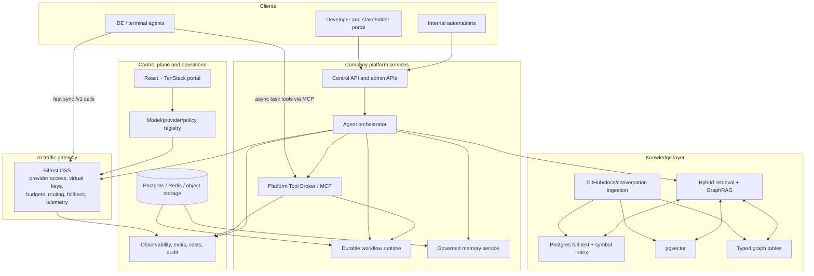

# Internal Agentic AI Platform Blueprint

> **Status:** Final pre-implementation blueprint
> **Audience:** founders, engineering leadership, platform team, implementation engineers

Build a private, company-owned AI development and knowledge platform: a controlled internal alternative
to external coding-assistant subscriptions and proprietary AI IDEs. The platform is a governed
agentic infrastructure layer for coding, repository knowledge, stakeholder Q&A, cost control, and
safe tool execution.

## Final document set

The implementation blueprint is intentionally limited to five documents:

1. `AI-Platform-Proposal.md` - product vision, scope, final executive decisions, and requirements.
2. `docs\01-system-architecture-and-interfaces.md` - service boundaries, APIs, IDE compatibility, MCP, and security boundaries.
3. `docs\02-agent-workflows-tools.md` - supervisor/sub-agent runtime, durable workflows, tools, skills, approvals, and budgets.
4. `docs\03-knowledge-retrieval-evaluation.md` - ingestion, retrieval, GraphRAG, memory, cache safety, and eval gates.
5. `docs\04-technology-roadmap-operations.md` - ADRs, model/provider registry, deployment, roadmap, SLOs, cost, DR, and runbooks.

## Executive decisions

| Area | Final decision |
|---|---|
| Platform posture | Company-owned, single-tenant internal platform with project/team/user isolation. |
| Gateway | Self-hosted Bifrost OSS on Railway for provider access, virtual keys, budgets, routing, fallback, load balancing, semantic caching, Prometheus, and OpenTelemetry. |
| External MCP | The Platform Tool Broker serves the external MCP endpoint. Bifrost is not exposed as a raw tool-policy surface to IDEs. |
| Agent runtime | Build a small Postgres-backed durable workflow runtime for the first internal release, with mandatory migration triggers to Hatchet OSS or Temporal OSS if scope or reliability thresholds are exceeded. |
| Retrieval | Start with Postgres full-text search, pgvector, **self-hosted Neo4j Community**, and object storage snapshots. Postgres remains the source of truth for ACLs/metadata; Neo4j handles multi-hop graph traversal for GraphRAG. |
| Identity | Better Auth OSS is the first-release human authentication layer, backed by Railway Postgres and invite-only internal accounts. GitHub App permission sync supplies repository ACLs and CODEOWNER context. |
| Provider policy | Every outbound model call is checked against project data class, provider terms, region, DPA/ZDR status, and prompt/trace storage policy. |
| IDE protocols | Expose OpenAI-compatible Chat Completions, Anthropic-compatible Messages, and MCP Streamable HTTP/SSE compatibility. |
| Async IDE tasks | Durable IDE tasks use exactly five MCP tools: `start_background_task`, `check_task_status`, `get_task_result`, `cancel_task`, and `list_task_artifacts`. |
| UI | React, TanStack Router, TanStack Query, TanStack Table, and TanStack Virtual. TanStack Start is not part of the first release. |
| Deployment | Railway-first for gateway, portal, APIs, workers, Postgres, Redis, object storage, and Bifrost. Any non-Railway hosting migration requires explicit manual approval after measured SLO evidence. |
| Secrets | Railway variables hold bootstrap and runtime secrets for the first release. Provider keys and break-glass credentials use application-level encryption, access audit, TTL, and rotation; Azure, AWS, or GCP secret services require explicit manual approval. |
| Observability | OpenTelemetry, Prometheus, Grafana dashboards, platform trace/eval/cost tables, and immutable audit events. |
| Self-hosted GPU models | Runtime is deferred. The model registry includes a vLLM-compatible provider shape from day one so the route can be activated without API redesign. |
| Validation | Evals are mandatory gates before production enablement of model aliases, routing changes, retrieval strategies, prompts, tools, and skills. |

## Resolved immediate validation decisions

The previously open validation decisions are now resolved as follows:

| Decision | Resolution |
|---|---|
| Bifrost HA posture | Use **self-hosted Bifrost OSS single-node** on Railway first. Do not pay for Enterprise now. Mitigate with monitoring, config backups, and audited break-glass direct-provider access. |
| Bifrost disadvantage | Main risk is availability/operations: one gateway node can block model traffic; OSS HA/RBAC/audit/guardrails are limited; we own restarts/upgrades/support. Proceed because it fits the gateway need and keeps cost low. |
| Workflow engine | Do **not** use Temporal Cloud. Build a minimal Postgres-backed durable workflow runtime first; keep self-hosted Hatchet OSS / Temporal OSS as migration targets. |
| Eval control plane | Build the minimal eval runner/result store/regression gates before enabling production models, routing, tools, prompts, skills, or retrieval changes. |
| Deployment | **Railway-first**. Do not move gateway/stateless services to Fly.io, Azure, AWS, GCP, or another managed platform without explicit approval after measured latency or reliability evidence. |
| Cloud/provider approval | Railway is the approved first-release platform. Non-Railway managed services, hosted auth layers, and Azure/AWS/GCP services are approval-gated before they can become committed dependencies. |
| Graph stack | Use **self-hosted Neo4j Community** for GraphRAG traversal. Keep Postgres for metadata, ACL source of truth, and simple relations. |
| Embeddings/reranker | Start with `BAAI/bge-m3` embeddings and `BAAI/bge-reranker-v2-m3`; evaluate `Qwen3-Embedding-4B` or a verified Nomic code embedding model for code-heavy retrieval. |
| Embedding migration | Use versioned collections, dual-write, background backfill, shadow eval, per-project alias cutover, 14-30 day rollback, then garbage collection. |
| Initial language coverage | TypeScript/JavaScript, React/TSX, TanStack Router/Query, Python, Node.js/TypeScript, Markdown, OpenAPI, JSON/YAML/TOML, package manifests, and environment examples. |

## Architecture overview

## Business goals

| Goal | Requirement |
|---|---|
| Reduce subscription dependency | Centralize access to direct model providers and hosted OSS inference; avoid avoidable per-seat lock-in. |
| Improve engineering productivity | Provide repo-aware, tool-using, multi-agent coding assistance with governed context. |
| Create durable company knowledge | Index code, docs, APIs, requirements, incidents, accepted decisions, and conversation summaries. |
| Support non-developers | Provide a safe portal for product, delivery, support, and executive project knowledge. |
| Control cost and quality | Route by task, model capability, latency, cost, policy, and eval score. |
| Preserve portability | Use standard Postgres, Redis protocol, containers, OpenTelemetry, and swappable model/provider adapters. |

## Personas

| Persona | Primary needs |
|---|---|
| Developer | Coding help, debugging, refactoring, tests, repo-aware Q&A, agentic task execution in IDE/terminal. |
| Tech lead / architect | Architecture discovery, dependency mapping, impact analysis, ADR lookup, review assistance. |
| Business analyst | Business-rule explanation, requirement-to-code traceability, API discovery, domain glossary. |
| Product owner / PM | Feature summaries, delivery-risk views, release notes, project status, code-to-product mapping. |
| Delivery manager | Dependency risks, ownership, stale docs, progress summaries, cross-team visibility. |
| Support team | Incident knowledge, behavior explanations, known-workaround discovery, API behavior Q&A. |
| New joiner | Guided onboarding, repository map, architecture walkthrough, implementation discovery. |
| Executive | High-level project health, capability summaries, risk summaries, business impact without code detail. |
| Platform admin | Provider keys, budgets, policies, model registry, indexes, evals, audit, and runbooks. |

## Scope rules

- **First production release:** gateway, identity, model registry, budget policy, sync IDE APIs, async MCP task tools, minimal durable workflows, read-only tool broker, GitHub permission sync, retrieval foundation, eval gates, admin portal, and developer onboarding.
- **Stakeholder portal:** ships after retrieval foundation with persona-specific answer contracts and citations.
- **Initial SCM:** GitHub only.
- **Initial language coverage:** TypeScript/JavaScript, React/TSX, Python, Node.js/TypeScript, Markdown, OpenAPI, JSON/YAML/TOML, package manifests, and environment examples.
- **Compliance posture:** formal certification is not part of the first release; code/IP safety, prompt-injection defense, secret leakage prevention, auditability, and permission boundaries are required.
- **Single-tenant platform:** one company-owned deployment with internal org/team/project/user isolation. Multi-company SaaS tenancy is out of scope.
- **Self-hosted GPU runtime:** provider interface only in the first release; runtime activation requires the criteria in `docs\04-technology-roadmap-operations.md`.

## Functional requirements

| ID | Requirement |
|---|---|
| FR-1 | Expose OpenAI Chat Completions and Anthropic Messages compatible endpoints. |
| FR-2 | Expose an MCP endpoint through the Platform Tool Broker for IDE tools and async task tools. |
| FR-3 | Bind virtual keys to principals with budgets, rate limits, data-class policy, and audit attribution. |
| FR-4 | Route requests by model capability, policy, cost, latency, context size, eval score, and override rules. |
| FR-5 | Persist agent workflows, sub-agent runs, artifacts, tool calls, approvals, errors, and summaries. |
| FR-6 | Retrieve from code, docs, APIs, requirements, incidents, accepted decisions, and generated summaries. |
| FR-7 | Preserve citations and provenance for every knowledge answer and context pack. |
| FR-8 | Enforce ACLs before retrieval results reach any model, tool, cache, or user. |
| FR-9 | Provide persona-specific answer contracts for technical, product, business, architecture, support, and executive views. |
| FR-10 | Run eval gates before enabling production models, routing changes, retrieval strategies, prompts, tools, or skills. |
| FR-11 | Keep synchronous IDE `/v1/*` calls separate from durable multi-step workflows. |
| FR-12 | Sync GitHub permissions into platform ACLs and default-deny repo retrieval when permission sync is stale. |
| FR-13 | Enforce provider data-class policy before outbound model calls. |
| FR-14 | Treat retrieved content as tainted input unless explicitly trusted; tainted context cannot grant permissions or approve tools. |
| FR-15 | Provide an audited break-glass direct-provider path with approval, TTL, and mandatory rotation. |

## Non-functional requirements

| Category | Requirement |
|---|---|
| Reliability | First internal rollout target is 99.5% simple gateway availability; workflow state must survive process restart. |
| Latency | Gateway p95 internal overhead for India developers must stay at or below 250 ms after provider latency is removed. |
| Security | Least-privilege provider keys, Better Auth-backed human sessions, project ACLs, tool allowlists, sandboxing, secret scanning, signed webhooks, and audit logs. |
| Operability | A small platform team can operate the stack with Railway, application-managed secrets, Railway object storage, and limited stateful services. |
| Portability | Use containers, Postgres, Redis protocol, OpenTelemetry, and S3-compatible storage. |
| Auditability | Every model call, route, tool call, sub-agent delegation, approval, retrieved source, policy change, and break-glass action is traceable. |
| Cost governance | Costs are attributable by org, team, project, user, virtual key, workflow, sub-agent, model, provider, and tool class. |
